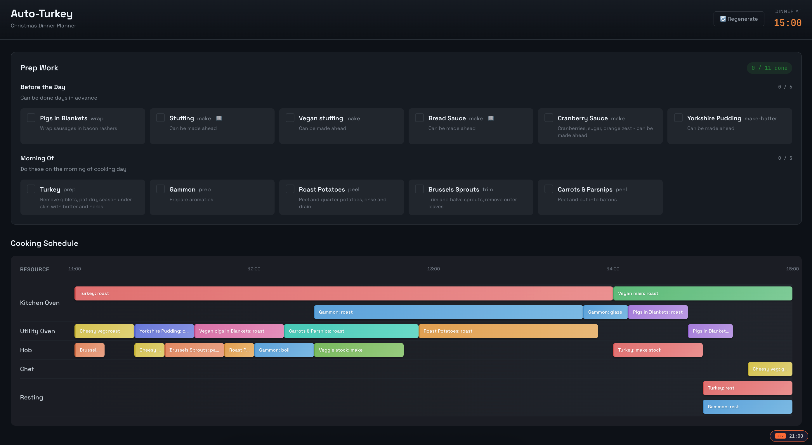

# Auto Turkey 🦃

A Christmas dinner scheduling optimizer that helps you coordinate cooking multiple dishes across limited kitchen resources (ovens, hobs, etc.) so everything is ready at the same time.



## Architecture

```
┌─────────────────────────────────────────────────────────────────┐
│                         Frontend (React)                         │
└─────────────────────────────┬───────────────────────────────────┘
                              │ REST API
                              ▼
┌─────────────────────────────────────────────────────────────────┐
│                      Backend (ASP.NET Core)                      │
│                                                                  │
│  ┌────────────────────────┐      ┌───────────────────────────┐  │
│  │   Schedule Optimizer   │      │      SQLite Database      │  │
│  │  (OR-Tools CP-SAT)     │      │  (settings, task state)   │  │
│  └────────────────────────┘      └───────────────────────────┘  │
│              │                                                   │
│              ▼                                                   │
│  ┌──────────────────────────────────────────────────────────┐   │
│  │                      dishes.json                          │   │
│  │         (Machine definitions + Dish configurations)       │   │
│  └──────────────────────────────────────────────────────────┘   │
└─────────────────────────────────────────────────────────────────┘
```

## Getting Started

### Prerequisites

- [.NET 8 SDK](https://dotnet.microsoft.com/download/dotnet/8.0)
- [Node.js](https://nodejs.org/) (v18+ recommended)

### Clone the Repository

```bash
git clone https://github.com/YOUR_USERNAME/auto-turkey.git
cd auto-turkey
```

### Run the Backend

```bash
cd backend/AutoTurkey.Api
dotnet run
```

The API will start on `http://localhost:5062`.

### Run the Frontend

In a separate terminal:

```bash
cd frontend
npm install
npm run dev
```

The frontend will start on `http://localhost:5173`.

### Generate Your Schedule

1. Open the app in your browser at `http://localhost:5173`
2. Set your desired dinner time using the time picker
3. **Click "Generate Schedule"** to create an optimized cooking timeline
4. Follow the Gantt chart for timed tasks and check off prep tasks as you complete them

## Customizing Your Menu

The menu and kitchen setup are configured in `backend/AutoTurkey.Api/Data/dishes.json`.

### Structure

```json
{
  "machines": [
    { "name": "Kitchen Oven", "maxCapacity": 2 },
    { "name": "Hob", "maxCapacity": 4 }
  ],
  "dishes": [
    {
      "name": "Turkey",
      "recipeUrl": "https://example.com/recipe",
      "prepTasks": [
        {
          "name": "prep",
          "description": "Season the turkey",
          "when": "Morning"
        }
      ],
      "scheduledTasks": [
        {
          "name": "roast",
          "durationMinutes": 180,
          "machine": "Kitchen Oven"
        }
      ]
    }
  ]
}
```

### Machines

Define your kitchen equipment. `maxCapacity` allows multiple items to cook simultaneously (e.g., a hob with 4 burners).

### Dishes

Each dish can have:

| Field | Description |
|-------|-------------|
| `name` | Display name for the dish |
| `recipeUrl` | Optional link to the recipe |
| `prepTasks` | Tasks to complete before cooking (not scheduled on machines) |
| `scheduledTasks` | Timed cooking tasks that use machines |

### Prep Tasks

| Field | Values |
|-------|--------|
| `when` | `"BeforeDay"` (day before), `"Morning"` (morning of), `"Anytime"` |

### Scheduled Tasks

| Field | Description |
|-------|-------------|
| `durationMinutes` | How long the task takes |
| `machine` | Which machine it uses (must match a machine name), or `null` for tasks like "rest" |

Tasks within a dish are scheduled **sequentially** - each task starts after the previous one finishes.

## How the Optimizer Works

The scheduler uses [Google OR-Tools](https://developers.google.com/optimization) CP-SAT constraint solver to find an optimal cooking schedule.

### Objective

**Push all tasks as late as possible** while still finishing by dinner time. This ensures:
- Food is freshly cooked when served
- You're not waiting around with finished dishes going cold
- Maximum flexibility in case things run over

### Constraints

1. **Machine capacity**: Each machine can only handle `maxCapacity` items at once (e.g., 2 trays in an oven)
2. **Task sequence**: Tasks within a dish must run in order (you can't glaze the gammon before roasting it)
3. **Deadline**: Everything must finish by dinner time

### How It Works

1. Creates time interval variables for each cooking task
2. Expands multi-capacity machines into virtual instances (e.g., "Hob #1", "Hob #2", etc.)
3. Adds no-overlap constraints so tasks don't conflict on the same machine instance
4. Adds precedence constraints to enforce task ordering within dishes
5. Maximizes the minimum start time across all tasks (pushes everything late)
6. Solves and maps results back to real clock times relative to your dinner time

The result is a Gantt chart showing exactly when to start each cooking task across all your kitchen equipment.

